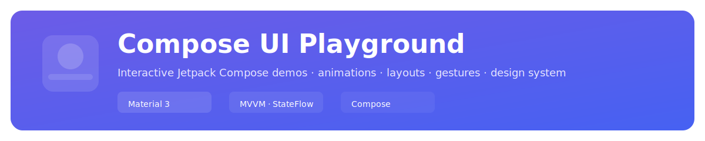
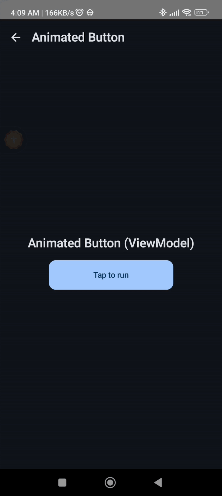

<!-- Project banner -->

  

  <picture>
    <source srcset="assets/banner.svg" type="image/svg+xml">
    
  </picture>

# Compose UI Playground
> Interactive Jetpack Compose demos — animations, layouts, gestures, and a small design system.

A curated Jetpack Compose portfolio showcasing animations, gestures, custom layouts, and modern UI engineering.

     

This project is an expanding gallery of high-quality Compose UI demos, built one tiny step at a time.
Perfect for showcasing modern Android UI skills in a clean, structured, modular way.

🎨 Features (Current)
🧭 Core

Catalog Screen — grouped demo list with reusable DemoCard components

Typed Navigation — sealed PlaygroundScreen routes for safe navigation

Material 3 Design System — dynamic color, custom typography, spacing tokens

🎥 UI Demos
✨ Animated Button

Morphing width, state machine: Idle → Loading → Success

📚 Complex LazyColumn

Section headers + card lists

⚠️ GIFs are placeholders until final demo assets are added.

🛠️ Tech Stack

Jetpack Compose Material 3

Kotlin StateFlow + MVVM

Navigation Compose

Dynamic theming (Android 12+)

Scalable multi-category demo structure

Reusable UI primitives (Spacing, Typography, SectionHeader, DemoCard, etc.)

🚀 Getting Started
1. Clone the project
   git clone https://github.com/rishi-ritesh/compose-ui-playground.git

2. Open in Android Studio

Requires Android Studio Giraffe or newer.

3. Run

Launch the app module on an emulator or device.

📂 Project Structure
composeplayground/
├── app/
│    └── playground/
│         ├── demos/
│         │    ├── animations/
│         │    ├── layouts/
│         │    ├── gestures/
│         │    ├── components/
│         ├── navigation/
│         ├── ui/
├── ui/theme/
└── assets/gifs/

The structure is intentionally designed for long-term scalability — adding new demos requires no refactor.

🧭 Roadmap (Coming Soon)
Animation Demos

Visibility animations

State transitions

Physics-based movements

Layout Demos

Staggered grid

Flow layout

Custom measurement/placement

Gesture Demos

Drag & drop

Swipe actions

Pinch-to-zoom

Component Showcases

Advanced text fields

Custom top bars

Cards, chips, sections

Utilities

In-app code viewer

Screenshot generator

Demo comparison tools

📝 Status

🚧 Work in progress — new demos added step-by-step.
This repo grows with every iteration and is designed to be a live portfolio of your Compose skills.